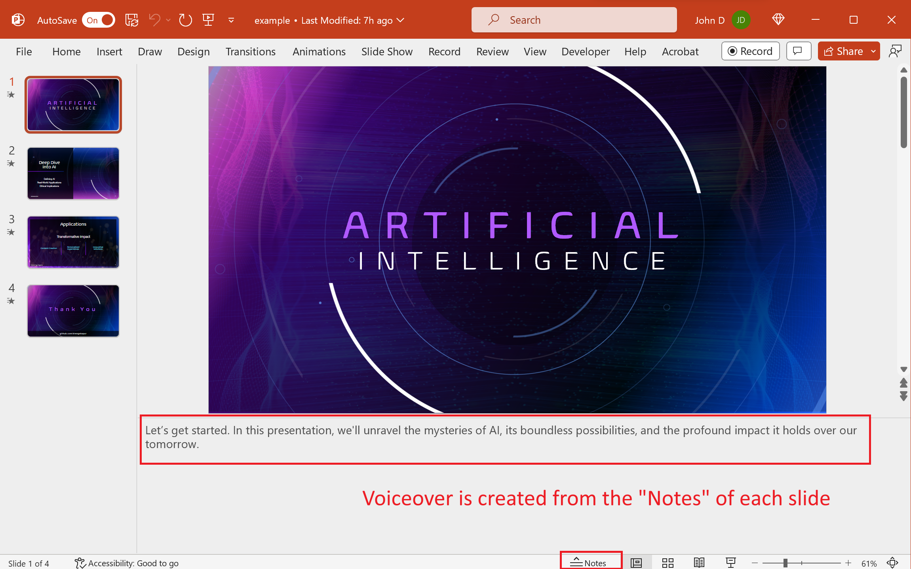

# slides2video
Transform PowerPoint presentations to videos with voiceovers.

> [!IMPORTANT]
> You must have an [OpenAI API key](https://platform.openai.com/api-keys).

Preview example output [here](example.mp4).

The voiceover text is generated from the "Notes" section of each PowerPoint slide.



## Run in Google Colab [](https://colab.research.google.com/drive/1KRWFApDh82o2mE_b6x9tnf9Ofipts6QO?usp=sharing)

This is the easiest method because all the infrastructure is set up.

## OpenAI API Key

Put your OpenAI API key in the `.env` file:

`.env`

```
OPENAI_API_KEY='<YOUR_OPENAI_API_KEY>'
```

## Manual Execution

Install LibreOffice and FFmpeg:

1. **LibreOffice**: Download and install from [LibreOffice Download](https://www.libreoffice.org/download/download-libreoffice/).
2. **FFmpeg**: Download and install from [FFmpeg Download](https://ffmpeg.org/download.html).

Clone the repository:

```console
git clone https://github.com/drengskapur/slides2video
```

Install pip requirements:

```console
pip install -r requirements.txt
```

To run the pipeline, enter the command:

```console
dvc repro
```

## Docker

To use the Docker image, put the PowerPoint (`.pptx`) inside the `input` folder, and run:

```bash
./run.sh
```
